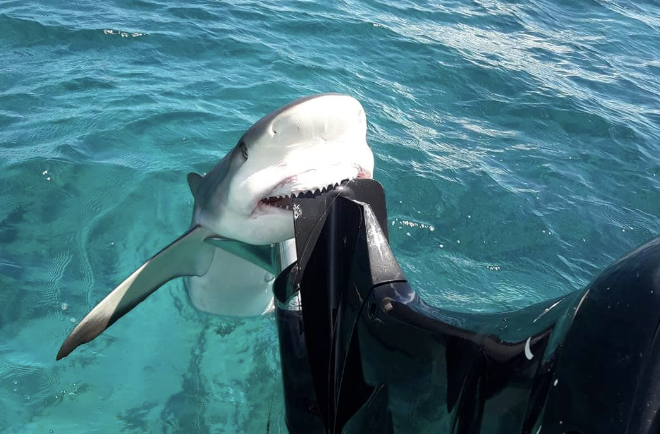
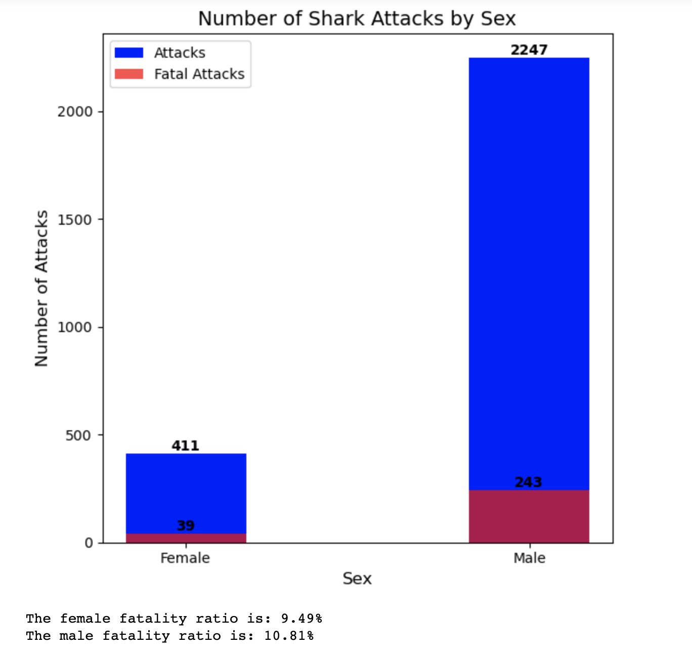
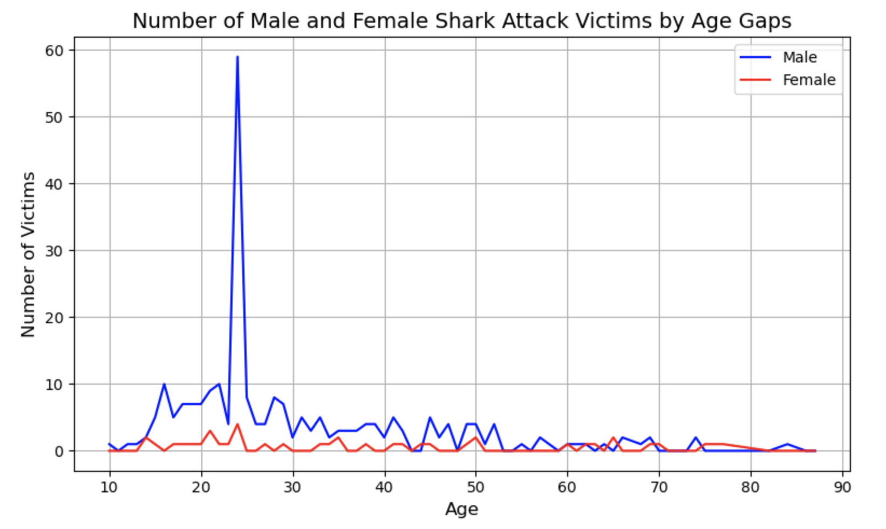
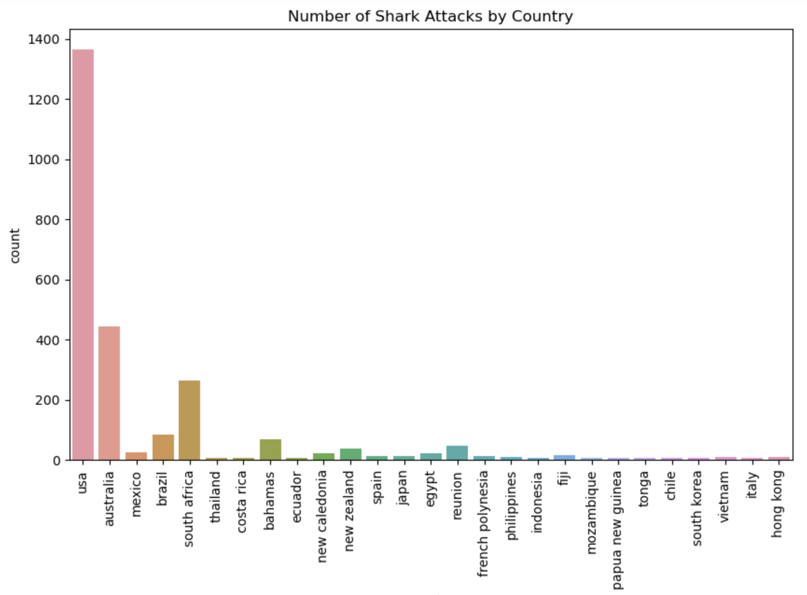

# Data Cleaning Shark Attack

# 1. What are the conditions that precede **fatal attacks**?
The aim of this project is to find the correlation between the fatality of attacks and the circumstances surrounding the attacks. Thus preventing and educating people on how to avoid risky situations.

This document will explain the process of the finding and the manipulation of the jaws.csv (extracted from https://www.kaggle.com/datasets/teajay/global-shark-attacks?resource=download)

# The premise
The data set obtained from Kaggle is very messy and lacks any structure. I have to clean and manipulate this data without breaking this two rules:

## You can´t delete any columns of the dataset
## You can´t have less that 2500 rows in the dataset

This two rules can´t explicitly be broken. Anything that goes arround this is permited. 

Let's begin!

# 2. Cleaning the Data:

## 2.1 Duplicates and Objective row

Step 1: Drop duplicates. Eliminates around 19000 rows of suplicated data.

Step 2: Change the column names for ease of access.

Step 3: Check the fatality column for Y and N values. Clean the values with regex asnd return a df with a clean 'fatality column'

*Commit number 2 and 3*

Started with fatality row because it is our objective row. Now we will clean the rest of the relevant data. We have to deal with 

## 2.2 Date, Case Num, Year... Columns

Fill the Date data with the other column and then refill the case num columns with index. This way we can fill up the Date data and delete the redundant data

Step 1: Reformat casenumber column

For this step I created three funtions that filter the casenumber, dates, reformating the ones with letters and replacing the ones that aren't valid dates with nan. this part has to be done at the end(*Then I filter the dates by year and delete all the data before 1960 to obtain 3444 rows.*)

*commit 4*

Step 2: Change the Dates and years based on casenumber.

Justification: Because the year and date columns have the same data as casenumber but in different format and because i have 3444 valid casenumber values i will fill the cells of both columns from the casenumber data.

Step 3: Changed casenumber and original number with index

## 2.3 Age and Sex

*commit 5 and 6*

Step 1: Filter both age and gender with their respective function.

Step 2: Drop all the rows where age and gender are not null. We need to have ideally both and at least one of those values

## 2.4 Type column fix

There are only 3 null values that can be known looking at the activity. Then we normalice the boat type and its done!

## 2.5 Species

Create a filter with a list of keyword to substitute the mildly defines shark species with 'unknown'

*commit 7*

## 2.6 Location, Country, Area

Take out every weird character and fill nans with 'unknown'

*commit 8*

## 2.7 Activity, Injury, Time

For this last columns i reused the function from country and replaced the nans with unknown

*commit 9*

## 2.8 Filling the nans

For the age i use the median
Delete all the nans
Remove every date before 1975

## 2.9 Saving the dataframe

safe the dataframe as jaws_clean.csv to plot it in another notebook

*commit 10 y 11*

leyenda:

fatality: yes = 1 : no = 0
sex: Male = 1 : Female = 0

# 3. Analisis

*commit 12*